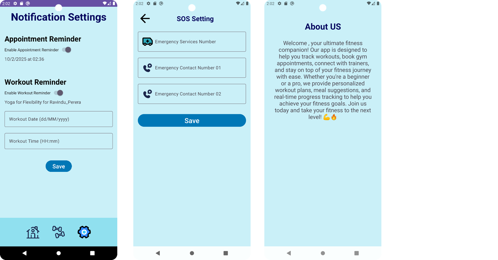

# SmartFit App

## Introduction
The **SmartFit App** is a digital fitness platform that connects users with personal trainers and nutritionists. It provides tailored fitness programs, meal plans, emergency contact features, first aid resources, and health education. Our goal is to simplify users’ daily routines while improving their overall well-being.

## System Overview
### Technology Used
| Component          | Technology Used       |
|-------------------|----------------------|
| Development Tools | Android Studio, Java |
| Database         | Firebase Firestore   |
| APIs             | Firebase, Cloudinary, Java Time |
| Libraries        | Picasso |

### Features
- **Personal Fitness Management** – Customized training programs, nutrition plans, and activity tracking.
- **Emergency Contact** – Auto-dial emergency services, live location sharing, and nearby hospital locator.
- **Health Education Tips** – Latest health trends, fitness tips, and nutrition advice.
- **Progress Tracking** – Users can upload and compare progress photos.
- **Appointment Scheduling** – Trainers and nutritionists can manage client appointments, share workout plans, and schedule virtual meetings.
  
## Interface

Login and register


User (Client)




Trainer


Nutrition


## Getting Started
### Prerequisites
- Install **Android Studio**
- Set up **Firebase** for authentication and database
- Add necessary dependencies for **Picasso, Firebase, and Cloudinary**

### Installation
1. Clone the repository:
   ```sh
   git clone https://github.com/sithilaA/SmartFit_Android_App.git
   ```
2. Open the project in **Android Studio**.
3. Configure **Firebase** in the app.
4. Build and run the application on an emulator or a physical device.

## Contributing
We welcome contributions! Follow these steps:
1. Fork the repository.
2. Create a new branch: `git checkout -b feature-branch`
3. Commit your changes: `git commit -m 'Add new feature'`
4. Push to the branch: `git push origin feature-branch`
5. Open a pull request.

## License
This project is open source and available under the **MIT License**.

```
MIT License

Copyright (c) 2025 SmartFit

Permission is hereby granted, free of charge, to any person obtaining a copy
of this software and associated documentation files (the "Software"), to deal
in the Software without restriction, including without limitation the rights
to use, copy, modify, merge, publish, distribute, sublicense, and/or sell
copies of the Software, and to permit persons to whom the Software is
furnished to do so, subject to the following conditions:

(Full license text here)
```


